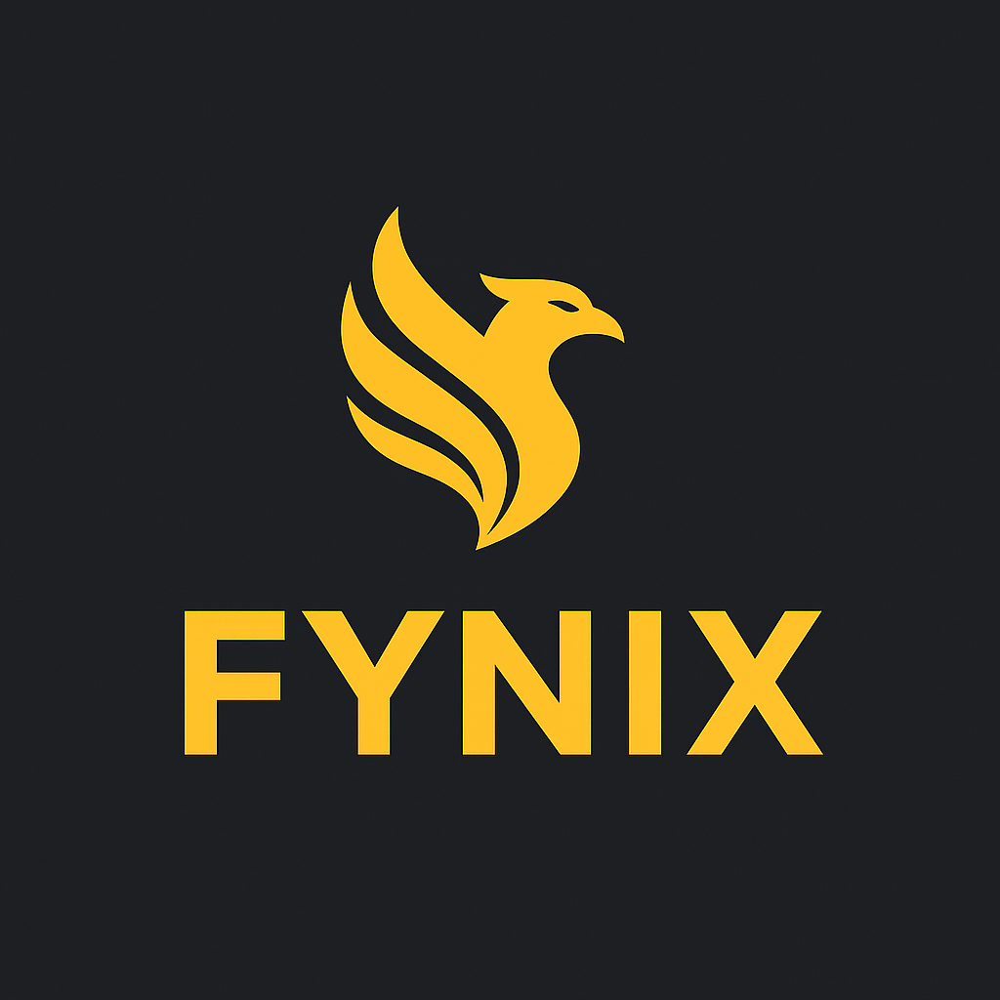

# Fynix Library Builder

<p align="center">
  
</p>

<p align="center">
  A desktop utility for browsing IPTV provider content and building a local `.strm` file library for use in media centers like Kodi, Plex, or Jellyfin.
</p>

---

## Table of Contents

- [Features](#features)
- [How It Works](#how-it-works)
- [Installation](#installation)
- [Usage](#usage)
- [Technical Overview](#technical-overview)

---

## Features

- **Easy Setup**: A step-by-step setup wizard to configure your IPTV provider details and library folders on the first run.
- **Category Management**: Easily enable or disable VOD and Series categories to control what content appears in your library.
- **Manual & Scheduled Updates**: Trigger a library update manually or schedule it to run at a specific time each day.
- **Server Configuration**: Update your server details at any time from the main settings window.
- **Database Statistics**: See a live count of the total and visible movies, series, and episodes in your database.
- **System Tray Integration**: The application minimizes to the system tray and can run continuously in the background to perform scheduled updates.
- **Modern UI**: A clean, dark-themed user interface.

## How It Works

Fynix Library Builder connects to your IPTV provider's API to fetch lists of available movies and TV series. Based on the categories you have enabled, it then generates a local folder structure containing `.strm` files.

These `.strm` files are simple text files that contain a direct URL to the media stream. You can add the generated folders (e.g., `/path/to/your/movies` and `/path/to/your/series`) as library sources in media center software like Kodi. Your media center will scan these files and import the content as if it were stored locally, fetching metadata and artwork automatically.

This allows you to browse your provider's VOD and series library using the rich interface of a full-fledged media center.

## Installation

**For Linux users:**

```bash
wget -O - https://raw.githubusercontent.com/Boc86/Fynix-Library-Builder/main/install.sh | bash
```

**For Windows users (PowerShell):**

```powershell
Invoke-WebRequest -Uri "https://raw.githubusercontent.com/Boc86/Fynix-Library-Builder/main/install.ps1" -OutFile "$env:TEMP\install.ps1"; Start-Process powershell -Verb RunAs -ArgumentList "-NoProfile -ExecutionPolicy Bypass -File \"$env:TEMP\install.ps1\""
```

**Manual Installation:**

1.  **Clone the repository:**
    ```bash
    git clone https://github.com/Boc86/Fynix-Library-Builder.git
    cd Fynix-Library-Builder
    ```

2.  **Create a Python virtual environment:**
    ```bash
    python3 -m venv .venv
    source .venv/bin/activate
    ```

3.  **Install dependencies:**
    ```bash
    pip install -r requirements.txt
    ```

4.  **Run the application:**
    ```bash
    python3 main.py
    ```
    On the first run, you will be guided by the Setup Wizard.

## Usage

- **Initial Setup**: Follow the wizard to enter your server details and specify where you want your movie and series `.strm` files to be saved.

- **Main Window**:
    - **Server Configuration**: Allows you to view and update your IPTV provider details.
    - **Actions**: 
        - `Save All Changes`: Saves any modifications to the server, category, or schedule settings.
        - `Update Library`: Manually triggers the creation of `.strm` files.
        - `Clear Cache`: Clears all cached metadata.
    - **Auto Update**: Enable the checkbox and set a time to have the library update run automatically each day.
    - **Database Statistics**: View counts of your media library.
    - **Category Panes**: Check or uncheck categories to control which ones are included in your library. Remember to click `Save All Changes` after making modifications.

- **Background Operation**:
    - Closing the window will minimize the application to the system tray.
    - Right-click the tray icon to show the window or quit the application.

## Technical Overview

- **Framework**: Python 3 with PySide6 (Qt6) for the graphical user interface.
- **Database**: SQLite is used to store all metadata related to servers, categories, and media content.
- **Configuration**: 
    - `directories.toml`: Stores the paths to your media libraries.
    - `schedule.json`: Stores the settings for the auto-update feature.
- **Backend Logic**: The core application logic (database interaction, API calls) is separated in `backend.py`, allowing for a clean separation from the UI code in `main.py`.
- **Helpers**: The `helpers/` directory contains various scripts for database setup and content synchronization.

---

## License

This project is open-source. Feel free to modify and distribute it as you see fit.
